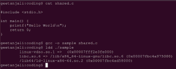
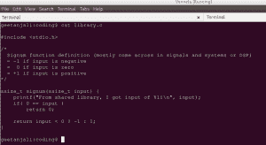
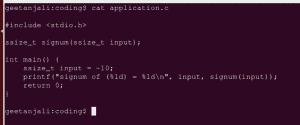

# 使用共享库|第 2 集

> 原文:[https://www . geesforgeks . org/work-with-shared-libraries-set-2/](https://www.geeksforgeeks.org/working-with-shared-libraries-set-2/)

我们已经在[之前的帖子](https://www.geeksforgeeks.org/working-with-shared-libraries-set-1/)中介绍了共享库的基本信息。在当前的文章中，我们将学习如何在 Linux 上创建共享库。

在此之前，我们需要了解程序是如何加载到内存中的，以及该过程中涉及的各种(基本)步骤。

让我们在 c 语言中看到一个典型的“Hello World”程序。下面给出了简单的 Hello World 程序屏幕图像。

我们使用命令“ **gcc -o sample shared.c** ”编译代码时，编译器不会解析函数 **printf()** 的实现。它只验证语法检查。工具链在我们的应用程序中留下了一个存根，它将由动态链接器填充。由于 printf 是标准函数，编译器隐式调用其共享库。更多细节记下。

我们正在使用 *ldd* 来列出我们的程序二进制映像的依赖关系。在屏幕图像中，我们可以看到我们的示例程序依赖于三个二进制文件，即 *linux-vdso.so.1* 、 *libc.so.6* 和*/lib 64/LD-Linux-x86-64 . so . 2*。

文件 VDSO 是快速实现系统调用接口和其他一些东西，它不是我们的重点(在一些旧的系统上你可能会看到不同的文件名在刘鹗的* .vsdo. *)。忽略此文件。我们对另外两个文件感兴趣。

文件 **libc.so.6** 是各种标准功能的 C 实现。在这个文件中，我们看到了我们的 *Hello World* 所需的*打印的*定义。它是运行我们的 Hello World 程序需要加载到内存中的共享库。

第三个文件/lib64/ld-linux-x86-64.so.2 实际上是在调用应用程序时运行的可执行文件。当我们在 bash 终端上调用程序时，通常 bash 会分叉自己，并用要运行的程序的映像替换它的地址空间(所谓的 fork-exec 对)。内核验证 libc.so.6 是否驻留在内存中。否则，它会将文件加载到内存中，并重新定位 libc.so.6 符号。然后，它调用动态链接器(/lib64/ld-linux-x86-64.so.2)来解析应用程序代码的未解析符号(在本例中为 printf)。然后控制转移到我们的程序*主*。(我在过程中有意省略了很多细节，我们的重点是了解基本细节)。

**创建我们自己的共享库:**

让我们在 Linux 上使用简单的共享库。创建一个包含以下内容的文件 **library.c** 。

文件库 c 定义了一个函数**，我们的应用程序代码将使用这个函数。使用以下命令编译文件库. c 文件。**

****gcc-shared-FPic-o lib library . so library . c****

**标志 *-shared* 指示编译器我们正在构建一个共享库。标志 *-fPIC* 是生成位置无关码(暂时忽略)。该命令在当前工作目录中生成一个共享库*libliblib . so*。我们已经准备好使用我们的共享对象文件(Linux 中的共享库名称)。**

**创建另一个文件 **application.c** ，内容如下。**

****

**在文件 **application.c** 中，我们正在调用在共享库中定义的函数 signum。使用以下命令编译 application.c 文件。**

****gcc 应用. c-L/home/geetanjali/coding/-library-o 样本****

**标志*-库*指示编译器寻找在当前代码中不可用的符号定义(在我们的例子中是 signum 函数)。选项 *-L* 是提示编译器在目录中查找任何共享库的选项(仅在链接期间)。该命令生成一个名为“**示例**的可执行文件。**

**如果调用可执行文件，动态链接器将无法找到所需的共享库。默认情况下，它不会查看当前的工作目录。您必须明确指示工具链提供正确的路径。动态链接器搜索 LD_LIBRARY_PATH 中可用的标准路径，也搜索系统缓存(有关详细信息，请浏览命令***【ldconfig】***)。我们必须将工作目录添加到 LD_LIBRARY_PATH 环境变量中。以下命令也是如此。**

****导出 LD _ LIBRARY _ PATH =/home/geetanjali/coding/:$ LD _ LIBRARY _ PATH****

**您现在可以调用我们的可执行文件，如图所示。**

****。/样品****

**我的系统上的示例输出如下所示。**

****

****注意:** *路径**/home/geetanjari/coding/**是我机器上的工作目录路径。无论工作目录路径在上面的命令中使用到哪里，都需要使用它。***

**请继续关注，我们甚至还没有探索 1/3 的共享库概念。更高级的概念在后面的文章中。**

****运动:****

**它就像一篇文章。除非你练习并做一些研究，否则你不会有什么收获。**

**1.创建一个类似的例子，并在共享库中编写您的 win 函数。在另一个应用程序中调用该函数。**

**2.是否有任何其他工具可以列出相关库？**

**3.什么是位置无关码(PIC)？**

**4.当前上下文中的系统缓存是什么？目录/etc/ld.so.conf.d/*在当前上下文中是如何关联的？**

**——[**文基**](http://www.linkedin.com/in/ramanawithu) 。如果你发现任何不正确的地方，或者你想分享更多关于上面讨论的话题的信息，请写评论。**