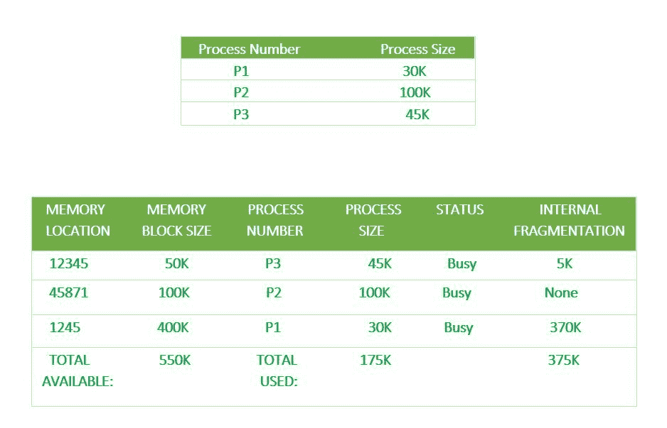

# 操作系统中最不适合的分配

> 原文:[https://www . geeksforgeeks . org/最不适合操作系统分配/](https://www.geeksforgeeks.org/worst-fit-allocation-in-operating-systems/)

对于[固定和动态内存分配方案](https://www.geeksforgeeks.org/partition-allocation-methods-in-memory-management/)，操作系统必须保留每个内存位置的列表，记录哪些是空闲的，哪些是繁忙的。然后，随着新作业进入系统，必须分配空闲分区。

这些分区可以通过 4 种方式分配:

```
1. First-Fit Memory Allocation
2. Best-Fit Memory Allocation
3. Worst-Fit Memory Allocation
4. Next-Fit Memory Allocation 
```

这些是**连续**内存分配技术。

[**【最差拟合内存分配】**](https://www.geeksforgeeks.org/program-worst-fit-algorithm-memory-management/) **:**
在这种分配技术中，进程遍历整个内存，始终搜索最大的空洞/分区，然后将进程放在那个空洞/分区中。这是一个缓慢的过程，因为它必须遍历整个内存来搜索最大的洞。

下面是一个理解最差匹配分配的例子–



这里，进程 P1=30K 是用最差适应分配技术分配的，因此它遍历整个内存并选择最大的内存大小 400K，因此有一个非常大的 370K 的内部碎片，因此许多其他进程也可以利用这个剩余空间。

**最差配合分配的优势:**
由于这个过程选择了最大的洞/分区，因此会有较大的内部碎片。现在，这种内部碎片会很大，因此其他小进程也可以放在剩余的分区中。

**最差配合分配的缺点:**
这是一个缓慢的过程，因为它遍历内存中的所有分区，然后在所有分区中选择最大的分区，这是一个耗时的过程。