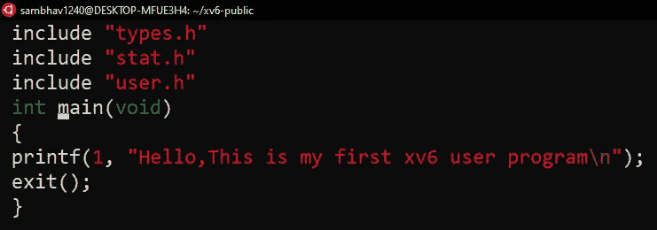

# Xv6 操作系统-添加用户程序

> 原文:[https://www . geesforgeks . org/xv6-操作系统-添加用户-程序/](https://www.geeksforgeeks.org/xv6-operating-system-add-a-user-program/)

Xv6 是 Unix 第六版的重新实现，以便用作学习工具。xv6 是麻省理工学院为他们的“6.828”课程开发的教学操作系统。关于 xv6 的一个重要事实是，它包含了所有的核心 Unix 概念，并且具有与 Unix 相似的结构，尽管它缺少一些现代操作系统所期望的功能。这是一个轻量级的操作系统，编译时间非常短，并且还允许远程调试。

xv6 的源代码可以克隆到你的机器上如下:
[https://github.com/mit-pdos/xv6-public](https://github.com/mit-pdos/xv6-public)



<center>Simple xv6 program</center>

**向 xv6 添加用户程序:**
在你的机器上完成 xv6 设置后，你可以看看如何向 xv6 添加新的用户程序。用户程序可以是一个简单的 C 程序。然而，仅仅向 xv6 文件夹添加一个文件是不够的，因为我们需要在 shell 提示符下让用户可以使用它。

**第一步:一个简单的 C 程序**
首先，我们创建一个如下的 C 程序。我们将其保存在 xv6 操作系统的源代码目录中，名字为 first.c 或您喜欢的任何名称。

## C

```
//A Simple C program
include "types.h"
include "stat.h"
include "user.h"

 //passing command line arguments

int main(int argc, char *argv[])
{
  printf(1, "My first xv6 program learnt at GFG\n");
  exit();
}

// This code is contributed by sambhav228
```

**第 2 步:编辑 Makefile**
Makefile 需要被编辑，以使我们的程序可用于 xv6 源代码的编译。

```
gedit Makefile 
```

这一行代码将在 gedit 文本编辑器中打开 Makefile。接下来，需要编辑 Makefile 的以下部分来首先添加您的程序

```
UPROGS=\
_cat\
_crash\
_echo\
_factor\
_forktest\
_grep\
_hello\
_init\
_kill\
_ln\
_ls\
_mkdir\
_null\
_rm\
_sh\
_share\
_stressfs\
_usertests\
_wc\
_zombie\
_first\
EXTRA=\

 mkfs.c ulib.c user.h cat.c echo.c forktest.c grep.c kill.c\
 ln.c ls.c mkdir.c rm.c stressfs.c usertests.c wc.c zombie.c\
 first.c\
 printf.c umalloc.c\
 README dot-bochsrc *.pl toc.* runoff runoff1 runoff.list\
 .gdbinit.tmpl gdbutil\  
```

现在，我们的 Makefile 和用户程序已经准备好接受测试。输入以下命令编译整个系统。

```
make clean
make 
```

现在，在 QEMU 上启动 xv6 系统，当它启动时，运行 ls 命令来检查用户是否可以使用我们的程序。如果是，给出该可执行程序的名称，在我的例子中是首先在终端上看到程序输出。

**输出:**
“我在 GFG 学的第一个 xv6 程序”在 QEMU 模拟器窗口显示了这个输出。