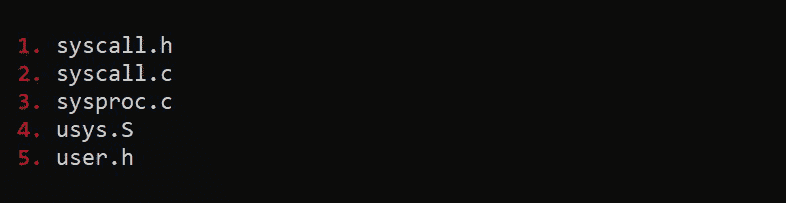

# Xv6 操作系统-增加新的系统调用

> 原文:[https://www . geesforgeks . org/xv6-操作系统-添加新系统-调用/](https://www.geeksforgeeks.org/xv6-operating-system-adding-a-new-system-call/)

先决条件–[Xv6 操作系统-添加用户程序](https://www.geeksforgeeks.org/xv6-operating-system-add-a-user-program/)

在上一篇[帖子](https://www.geeksforgeeks.org/xv6-operating-system-add-a-user-program/)中，我们了解了如何在 Xv6 操作系统中添加用户程序。现在，您将看到如何在 Xv6 操作系统中添加新的系统调用。

**向 xv6 添加新的系统调用:**
系统调用是程序与操作系统交互的方式。当一个计算机程序向操作系统内核发出请求时，它会进行系统调用。系统调用用于硬件服务、创建或执行进程，以及与内核服务通信，包括应用程序和进程调度。
**概述:**
您将实现名为 getyear 的系统调用，它将从内核总是返回 1975。那年发布了 Unix 版本 6。为了在 xv6 中定义您自己的系统调用，您需要对 5 个文件进行更改。即这些文件如下。
为了在 xv6 中定义自己的系统调用，需要对 5 个文件进行修改。即这些文件如下。



**创建系统调用以返回 Unix 版本 6 发布的年份:**
您可以从 syscall.h 文件开始工作，在该文件中，编号被分配给这个 Xv6 系统中的每个系统调用。如您所见，在这个文件中已经定义了 21 个系统调用。让我们继续，为您自己的系统呼叫在预订者系统呼叫号码中添加以下线路。

```
#define SYS_getyear 22
```

接下来，您需要在 syscall.c 文件中添加指向系统调用的指针。这个文件包含一个函数指针数组，它使用上面定义的数字(索引)作为指向在不同位置定义的系统调用的指针。为了添加您的自定义系统调用，请在此文件中添加以下行。

```
[SYS_getyear] sys_getyear
```

**这里发生了什么变化？**
这意味着，当系统调用号为 22 的系统调用发生时，函数指针 sys_getyear 指向的函数将被调用。所以，你必须实现这个函数。但是，这个文件不是您要实现它的地方。您只需将函数原型放在这个文件中。

所以，在这个文件中找到合适的位置并添加以下行。您可以看到所有其他 21 个系统调用函数的定义都是相似的。

需要添加到 syscall.c 文件的函数原型如下。

```
extern int sys_getyear(void)
```

接下来，您将实现系统调用函数。为此，请打开定义系统调用函数的 sysproc.c 文件。

```
//return the year of which
//Unix version 6 was released

int 
sys_getyear(void) 
{

return 1975;
} 
```

现在你只有两个小文件要编辑，这些文件将包含用户程序访问系统调用的接口。打开名为 usys 的文件。s，并在末尾添加下面的行。

```
SYSCALL(getyear)
```

接下来，打开名为 user.h 的文件并添加以下行。这是用户程序将要调用的函数。正如你现在知道的，系统中没有实现这样的功能。相反，从用户程序对下面函数的调用将被简单地映射到系统调用号 22，它被定义为 SYS_getyear 预处理器指令。系统知道这个系统调用到底是什么，以及如何处理。

```
int getyear(void);
```

如果您已经完成了上述所有过程，那么您已经成功地向 xv6 添加了新的系统调用。但是，为了测试它的功能，您需要添加调用这个系统调用的用户程序。

用户程序可以如下所示:

```
#include "types.h"
#include "stat.h"
#include "user.h"

int main(void) 
{
printf(1, "Note: Unix V6 was released in year %d\n", getyear());
    exit();
} 
```

为了将此用户程序添加到 xv6，您需要按照上述步骤添加用户程序。最后，在 qemu 窗口中运行用户程序，用户程序可以通过在终端上运行 make qemu 命令获得。

成功执行所有操作后，您将进入终端。
**输出:**

```
"Note:Unix V6 was released in year 1975"
```