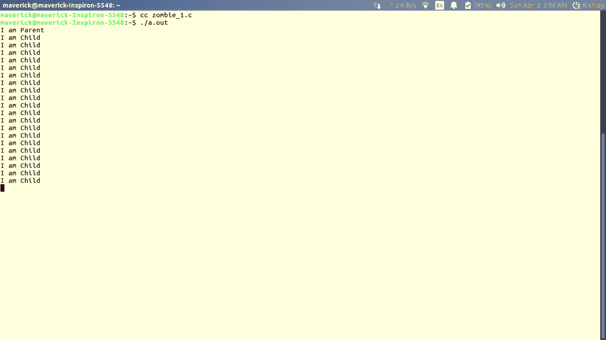
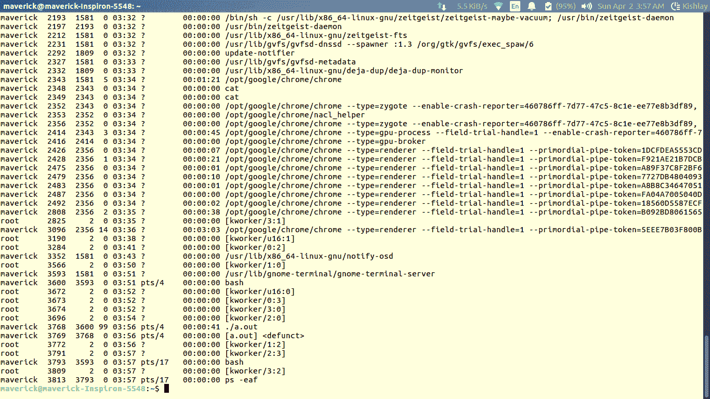
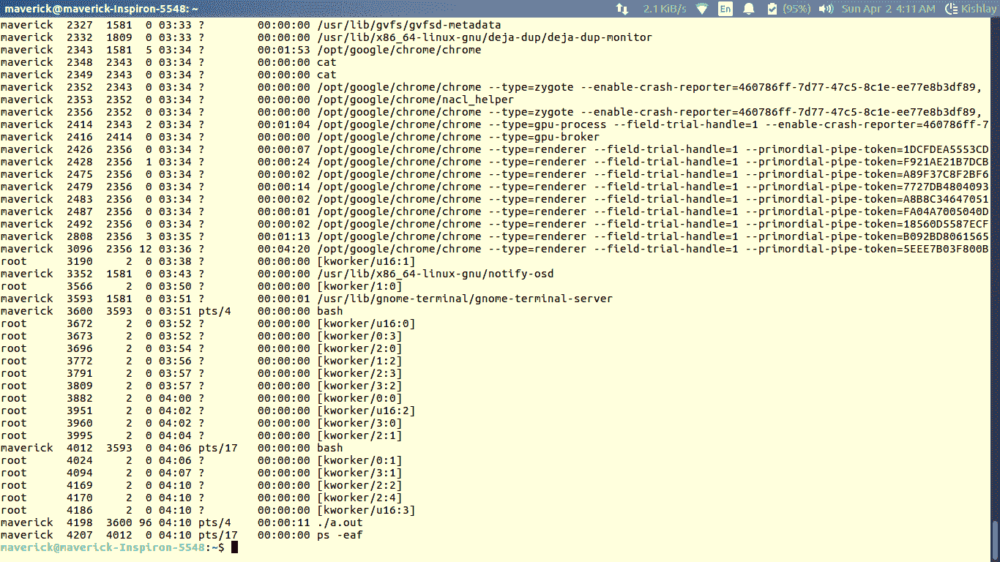

# 僵尸进程及其预防

> 原文:[https://www.geeksforgeeks.org/zombie-processes-prevention/](https://www.geeksforgeeks.org/zombie-processes-prevention/)

先决条件: [fork() in C](http://geeksquiz.com/fork-system-call/) 、[僵尸进程](https://www.geeksforgeeks.org/zombie-and-orphan-processes-in-c/)、
T5】僵尸状态:在 UNIX 中使用 fork()系统调用创建进程时，会复制父进程的地址空间。如果父进程调用 wait()系统调用，则父进程的执行将暂停，直到子进程终止。在子进程终止时，生成一个“SIGCHLD”信号，由内核传递给父进程。收到“SIGCHLD”后，父进程从进程表中读取子进程的状态。即使子进程被终止，进程表中也有一个条目对应于存储状态的子进程。当父项收集状态时，此条目将被删除。因此，子进程的所有痕迹都将从系统中移除。如果父节点决定不等待子节点的终止并执行其后续任务，那么在子节点终止时，退出状态不会被读取。因此，即使在子进程终止后，进程表中仍会保留一个条目。子进程的这种状态被称为僵尸状态。

## C

```
// A C program to demonstrate working of
// fork() and process table entries.
#include<stdio.h>
#include<unistd.h>
#include<sys/wait.h>
#include<sys/types.h>

int main()
{
    int i;
    int pid = fork();

    if (pid == 0)
    {
        for (i=0; i<20; i++)
            printf("I am Child\n");
    }
    else
    {
        printf("I am Parent\n");
        while(1);
    }
}
```

**输出:**



现在在终端
**$ ps -eaf** 中使用以下命令检查工艺表



这里的条目**【a . out】失效**显示的是僵尸进程。

**为什么我们需要阻止僵尸进程的创建？**
每个系统有一个工艺表。进程表的大小是有限的。如果生成了太多僵尸进程，那么进程表就会满。也就是说，系统将不能产生任何新的进程，那么系统将会停止。因此，我们需要防止僵尸进程的产生。

### 僵尸创造的不同表现方式

**1。使用 wait()系统调用:**当父进程在创建子进程后调用 wait()时，表示等待子进程完成，收获子进程的退出状态。父进程被挂起(在等待队列中等待)，直到子进程被终止。必须理解，在此期间，父进程什么也不做，只是等待。

## C

```
// A C program to demonstrate working of
// fork()/wait() and Zombie processes
#include<stdio.h>
#include<unistd.h>
#include<sys/wait.h>
#include<sys/types.h>

int main()
{
    int i;
    int pid = fork();
    if (pid==0)
    {
        for (i=0; i<20; i++)
            printf("I am Child\n");
    }
    else
    {
        wait(NULL);
        printf("I am Parent\n");
        while(1);
    }
}
```

**2。通过忽略 SIGCHLD 信号:**当一个子进程被终止时，一个相应的 SIGCHLD 信号被传递给父进程，如果我们调用‘SIGCHLD(SIG，SIG _ IGN)’，那么 SIGCHLD 信号被系统忽略，子进程条目从进程表中被删除。因此，没有僵尸被创造。但是，在这种情况下，父母不能知道孩子的退出状态。

## C

```
// A C program to demonstrate ignoring
// SIGCHLD signal to prevent Zombie processes
#include<stdio.h>
#include<unistd.h>
#include<sys/wait.h>
#include<sys/types.h>

int main()
{
    int i;
    int pid = fork();
    if (pid == 0)
        for (i=0; i<20; i++)
            printf("I am Child\n");
    else
    {
        signal(SIGCHLD,SIG_IGN);
        printf("I am Parent\n");
        while(1);
    }
}
```

**3。通过使用信号处理程序:**父进程为 SIGCHLD 信号安装信号处理程序。信号处理程序在其中调用 wait()系统调用。在这种情况下，当子进程终止时，SIGCHLD 被传递给父进程。收到 SIGCHLD 后，相应的处理程序被激活，进而调用 wait()系统调用。因此，父进程几乎立即收集退出状态，并清除进程表中的子条目。因此没有僵尸被创造出来。

## C

```
// A C program to demonstrate handling of
// SIGCHLD signal to prevent Zombie processes.
#include<stdio.h>
#include<unistd.h>
#include<sys/wait.h>
#include<sys/types.h>

void func(int signum)
{
    wait(NULL);
}

int main()
{
    int i;
    int pid = fork();
    if (pid == 0)
        for (i=0; i<20; i++)
            printf("I am Child\n");
    else
    {
        signal(SIGCHLD, func);
        printf("I am Parent\n");
        while(1);
    }
}
```

**输出:**



这里没有任何**【a . out】失效的**，即没有创建僵尸进程。

本文由**基什莱·维尔马**供稿。如果你喜欢 GeeksforGeeks 并想投稿，你也可以使用[write.geeksforgeeks.org](https://write.geeksforgeeks.org)写一篇文章或者把你的文章邮寄到 review-team@geeksforgeeks.org。看到你的文章出现在极客博客主页上，帮助其他极客。
如果你发现任何不正确的地方，或者你想分享更多关于上面讨论的话题的信息，请写评论。